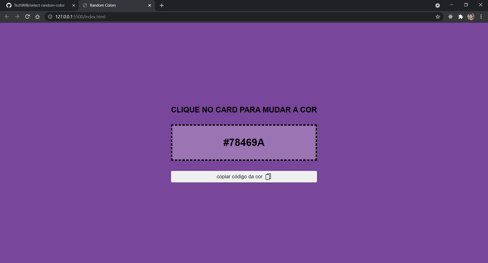

# Select Random Color
### Foi criado neste repositório um web app que faz gerar cores em código hexadecimal ao clicar no card. Também é possível copiar este código para o clipboard.

 

### Abaixo uma captura de tela do resultado:
